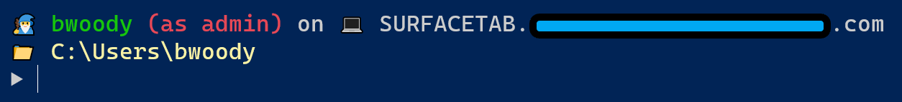

# Windows System Setup

These are a few of the scripts, commands, and other environment settings I use on my Windows systems. I'm currently running Windows 11 Enterprise, which is working well with these settings. I do everything in [PowerShell](https://learn.microsoft.com/en-us/powershell/) (Core) for my system management and configuration. Also, some of these commands won't run properly unless you are in "Elevated" or "Administrator" level, so be aware of that.

This is for info and examples **only**. I explain a few things here, but if *anything* is a new term or command, highlight it and look it up. Understand what your are doing if you want to try this - and you're on your own here - test first, don't run this in production first! 

### Disclaimer, for people who need to be told this sort of thing: 

*Never trust any script, presentation, code or information including those that you find here, until you understand exactly what it does and how it will act on your systems. Always check scripts and code on a test system or Virtual Machine, not a production system. Yes, there are always multiple ways to do things, and this script, code, information, or content may not work in every situation, for everything. It’s just an example, people. All scripts on this site are performed by a professional stunt driver on a closed course. Your mileage may vary. Void where prohibited. Offer good for a limited time only. Keep out of reach of small children. Do not operate heavy machinery while using this script. If you experience blurry vision, indigestion or diarrhea during the operation of this script, see a physician immediately*

If you want to suggest something here, add an [Issue](https://docs.github.com/en/issues/tracking-your-work-with-issues/creating-an-issue) referencing this page and what you want to mention. If I like it, I'll put it here. I'll not close the Issue unless it's a bug you've found, that way you can see what other people do that I didn't include. 

# Windows System Maintenance Checklist

1. **Create a System Restore Point**
   - Open **Control Panel** > **System and Security** > **System**.
   - Click **System protection** on the left.
   - Click **Create** and follow the prompts to create a restore point.

2. **Back Up Your Files**
   - Use either the command line [**ROBOCOPY**](https://lazyadmin.nl/it/robocopy-ultimate-guide/) or [use an option listed here](https://support.microsoft.com/en-us/windows/choose-a-backup-solution-in-windows-10-31495e5d-370e-3631-c773-44de4301e070).

3. **Backup BitLocker Keys**
   - Open **Control Panel** > **System and Security** > **BitLocker Drive Encryption**.
   - Click **Manage BitLocker**.
   - Select **Back up your recovery key** and choose a safe location to save the key (e.g., USB drive, Microsoft account, or print it).

4. **Update Windows**
   - Go to **Settings** > **Update & Security** > **Windows Update**.
   - Click **Check for updates** and install any available updates.
   - (See below if you want a comand-line way to do this)

5. **Run a Virus Scan**
   - Open **Windows Security** from the Start menu.
   - Go to **Virus & threat protection**.
   - Click **Quick scan** or **Full scan** to check for malware.

6. **Check for System File Integrity**
   - Open **Command Prompt** as an administrator.
   - Type `sfc /scannow` and press **Enter**.
   - Wait for the scan to complete and follow any instructions provided.

7. **Check Disk for Errors**
   - Open **File Explorer** and right-click on the drive you want to check.
   - Select **Properties** > **Tools** > **Check** under Error checking.
   - Follow the prompts to scan and repair the drive if necessary.

8. **Clean Up Disk Space**
   - Open **Disk Cleanup** by typing it in the Start menu search bar.
   - Select the drive you want to clean up and click **OK**.
   - Check the boxes for the types of files you want to delete and click **OK**.

9. **Defragment and Optimize Drives**
   - Open **Defragment and Optimize Drives** by typing it in the Start menu search bar.
   - Select the drive you want to optimize and click **Optimize**.

10. **Review Startup Programs**
    - Open **Task Manager** by pressing **Ctrl + Shift + Esc**.
    - Go to the **Startup** tab.
    - Disable any unnecessary programs that start with Windows.

# Initial Setup - Configure Powershell Environment

I like interesting prompts and so on. I also use [Windows Terminal](https://apps.microsoft.com/detail/9N0DX20HK701?launch=true&mode=full&referrer=bingwebsearch&ocid=bingwebsearch&hl=en-us&gl=US), which is really useful. My prompt looks like this (I blanked out my domain name in this graphic, it shows if you use this script:)

Here's how I configured my main profile in PowerShell:

<pre> notepad $profile </pre>

Then I entered this text in the file it creates: 

<pre>
function prompt {

    $host.ui.RawUI.WindowTitle = "Current Folder: $pwd"
    $CmdPromptUser = [Security.Principal.WindowsIdentity]::GetCurrent();
    $IsAdmin = (New-Object Security.Principal.WindowsPrincipal ([Security.Principal.WindowsIdentity]::GetCurrent())).IsInRole([Security.Principal.WindowsBuiltinRole]::Administrator)

    Write-Host ""
    Write-Host "`u{1F9D9} $($CmdPromptUser.Name.split("\")[1]) " -ForegroundColor Green -NoNewline
    Write-host ($(if ($IsAdmin) { '(as admin) ' } else { '' })) -ForegroundColor Red -NoNewLine
    Write-Host "on `u{1F4BB}" $env:COMPUTERNAME"."$env:USERDNSDOMAIN

    Write-Host "`u{1F4C1} $pwd"  -ForegroundColor Yellow 
    return "`u{25B6} "
} 
</pre>

## Maintenance - Install Choco from PowerShell

Package Managers are tools that help you install/configure/uninstall software from the command-line. 
I primarily use [winget](https://learn.microsoft.com/en-us/windows/package-manager/winget/) for that, since it's built into the latest Windows releases, but I really like the [chocolatey](https://chocolatey.org/) package manager for other things. Here's how I installed that on my system:

<pre>
Set-ExecutionPolicy Bypass -Scope Process -Force; [System.Net.ServicePointManager]::SecurityProtocol = [System.Net.ServicePointManager]::SecurityProtocol -bor 3072; iex ((New-Object System.Net.WebClient).DownloadString('https://community.chocolatey.org/install.ps1'))
</pre>

# Maintenance - Install PSWindowsUpdate

I keep my system up to date from the command line in PowerShell, and to completely do that I want to get the Windows Updates as well. I do that with a PowerShell module called [PSWindowsUpdate](https://woshub.com/pswindowsupdate-module/)

<pre>
Set-ExecutionPolicy -ExecutionPolicy Unrestricted
Install-Module -Name PSWindowsUpdate -Force
Add-WUServiceManager -ServiceID 7971f918-a847-4430-9279-4a52d1efe18d
</pre>

# Update Windows from Command Line 

As I mentioned, I run a complete update script to keep my system up to date and secure. I also do things like making sure the time is sync'd first (super important), find out the drive space, do some cleanup, and show my network status. 

> This is the most dangerous of the scripts, don't run this on your test system without understanding everything it does. Completely. You are on your own here.

<pre>
# updateme.ps1
# Author: Buck Woody
# Purpose: Windows 11 System Maintenance
# Version: 11.05122024

$host.ui.RawUI.WindowTitle = "Maintenance begins..."
#Install-Module -Name PSCalendar -RequiredVersion 2.9.0
get-calendar

$host.ui.RawUI.WindowTitle = "Synchronizing Clock..."
net start w32time
w32tm /resync

$host.ui.RawUI.WindowTitle = "Safety Scan..."
Write-Host "Running Windows Defender" -ForegroundColor Black -BackgroundColor DarkYellow
CD "C:\Program Files\Windows Defender\"
.\MpCmdRun.exe -scan -scantype 1

$host.ui.RawUI.WindowTitle = "Beginning update with Choco..."
Write-Host "Running Choco Upgrade" -ForegroundColor Black -BackgroundColor DarkYellow
choco upgrade all --confirm

$host.ui.RawUI.WindowTitle = "Beginning update with Winget..."
Write-Host "Running Winget Upgrade" -ForegroundColor Black -BackgroundColor DarkYellow
winget upgrade --all 

$host.ui.RawUI.WindowTitle = "Beginning update with PSWindowsUpgrade..."
Write-Host "Running PSWindowsUpgrade" -ForegroundColor Black -BackgroundColor DarkYellow 
get-windowsupdate
install-windowsupdate -acceptall | Format-Table -Property Result, Title, Description -wrap

$host.ui.RawUI.WindowTitle = "Upgrade WSL..."
Write-Host "Upgrade WSL" -ForegroundColor Black -BackgroundColor DarkYellow 
wsl --update
   
$host.ui.RawUI.WindowTitle = "Beginning File Cleanup with CleanMgr..."
Write-Host "Running CleanMgr" -ForegroundColor Black -BackgroundColor DarkYellow
Start-Process -FilePath CleanMgr.exe -ArgumentList '/sagerun:1' ##-WindowStyle Hidden

$host.ui.RawUI.WindowTitle = "Checking Logs for Errors..." 
Write-Host "Checking Event Logs... " -ForegroundColor Black -BackgroundColor DarkYellow
Get-EventLog -LogName System -EntryType Error | Out-GridView -Title "Windows System Log Error List"
Get-EventLog -LogName Application -EntryType Error  | Out-GridView -Title "Windows Application Log Error List"
Get-EventLog -LogName Security -EntryType Error | Out-GridView -Title "Windows Security Log Error List"

$host.ui.RawUI.WindowTitle = "Complete. System Information:" 

Write-Host "Drives: " -ForegroundColor Black -BackgroundColor DarkYellow
Get-Volume | sort-object Size

Write-Host "Network: " -ForegroundColor Black -BackgroundColor DarkYellow 
Get-NetIPConfiguration | format-table -autosize -Property InterfaceDescription, IPv4Address

Write-Host "GB of Memory om this system: " -ForegroundColor Black -BackgroundColor DarkYellow
(Get-CimInstance Win32_PhysicalMemory | Measure-Object -Property capacity -Sum).sum /1gb

pause

#Clear the event log
Write-Host "Stand by, clearing Event Logs...." -ForegroundColor Black -BackgroundColor DarkYellow 

function clear-all-event-logs ($computerName="localhost")
{
   $logs = Get-EventLog -ComputerName $computername -List | ForEach-Object {$_.Log}
   $logs | ForEach-Object {Clear-EventLog -ComputerName $computername -LogName $_ }
   Get-EventLog -ComputerName $computername -list
}

clear-all-event-logs -ComputerName COOMPUTERNAMEHERE
Write-Host "Maintenance Complete. " -ForegroundColor Black -BackgroundColor DarkYellow 
cd $HOME

# EOF: updatement.ps1
</pre>

# Configuration - Put Windows 11 Full Context Menu back in Explorer and Disable Web Searching

With all apologies to the Windows team (who are AWESOME), I like having the full menu available when  I right-click an item in the File Explorer in Windows. Again, do this at your own risk.

**[Back up your registry if you try this on a test system! You should be doing that anyway. Click here to learn more.](https://support.microsoft.com/en-us/topic/how-to-back-up-and-restore-the-registry-in-windows-855140ad-e318-2a13-2829-d428a2ab0692)**

The line after that adds a registry key to use only local search results, dramatically speeding up the Search function. 
<pre>
reg.exe add "HKCU\Software\Classes\CLSID\{86ca1aa0-34aa-4e8b-a509-50c905bae2a2}\InprocServer32" /f /ve
New-Item -Path "Registry::HKEY_CURRENT_USER\Software\Policies\Microsoft\Windows\Explorer"
New-ItemProperty -Path "HKCU:\Software\Policies\Microsoft\Windows\Explorer" -Name "Enabled" -Value "1" -PropertyType DWord
</pre>

## So what's your deal?

Like these? Am I doing something wrong or that I could do better? Hit me up in the "Issues" tab there at the top of the page. Be complete, not just "You're wrong". :) 
