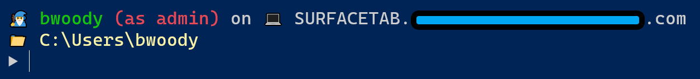

# Windows System Setup

These are a few of the scripts, commands, and other environment settings I use on my Windows systems. I'm currently running Windows 11 Enterprise, which is working well with these settings. I do everything in [PowerShell](https://learn.microsoft.com/en-us/powershell/) (Core) for my system management and configuration. Also, some of these commands won't run properly unless you are in "Elevated" or "Administrator" level, so be aware of that.

This is for info and examples **only**. I explain a few things here, but if *anything* is a new term or command, highlight it and look it up. Understand what your are doing if you want to try this - and you're on your own here - test first, don't run this in production first! I highly [recommend using the Windows Sandbox feature](https://learn.microsoft.com/en-us/windows/security/application-security/application-isolation/windows-sandbox/) to test things if you are running Windows 11.

### Disclaimer, for people who need to be told this sort of thing: 

*Never trust any script, presentation, code or information including those that you find here, until you understand exactly what it does and how it will act on your systems. Always check scripts and code on a test system or Virtual Machine, not a production system. Yes, there are always multiple ways to do things, and this script, code, information, or content may not work in every situation, for everything. It’s just an example, people. All scripts on this site are performed by a professional stunt driver on a closed course. Your mileage may vary. Void where prohibited. Offer good for a limited time only. Keep out of reach of small children. Do not operate heavy machinery while using this script. If you experience blurry vision, indigestion or diarrhea during the operation of this script, see a physician immediately*

If you want to suggest something here, add an [Issue](https://docs.github.com/en/issues/tracking-your-work-with-issues/creating-an-issue) referencing this page and what you want to mention. If I like it, I'll put it here. I'll not close the Issue unless it's a bug you've found, that way you can see what other people do that I didn't include. 

# Windows System Maintenance Checklist

1. **Create a System Restore Point**
   - Open **Control Panel** > **System and Security** > **System**.
   - Click **System protection** on the left.
   - Click **Create** and follow the prompts to create a restore point.
   - Note: The script below can do this, [but you have to edit your registry first. Use at your own risk](https://www.thewindowsclub.com/how-to-schedule-system-restore-points-in-windows-10).

2. **Back Up Your Files**
   - Use either the command line [**ROBOCOPY**](https://lazyadmin.nl/it/robocopy-ultimate-guide/) or [use an option listed here](https://support.microsoft.com/en-us/windows/choose-a-backup-solution-in-windows-10-31495e5d-370e-3631-c773-44de4301e070).

3. **Backup BitLocker Keys**
   - Open **Control Panel** > **System and Security** > **BitLocker Drive Encryption**.
   - Click **Manage BitLocker**.
   - Select **Back up your recovery key** and choose a safe location to save the key (e.g., USB drive, Microsoft account, or print it).

4. **Update Windows**
   - Go to **Settings** > **Update & Security** > **Windows Update**.
   - Click **Check for updates** and install any available updates.
   - (See below if you want a comand-line way to do this)

5. **Run a Virus Scan**
   - Open **Windows Security** from the Start menu.
   - Go to **Virus & threat protection**.
   - Click **Quick scan** or **Full scan** to check for malware.

6. **Check for System File Integrity**
   - Open **Command Prompt** as an administrator.
   - Type `sfc /scannow` and press **Enter**.
   - Wait for the scan to complete and follow any instructions provided.

7. **Check Disk for Errors**
   - Open **File Explorer** and right-click on the drive you want to check.
   - Select **Properties** > **Tools** > **Check** under Error checking.
   - Follow the prompts to scan and repair the drive if necessary.

8. **Clean Up Disk Space**
   - Open **Disk Cleanup** by typing it in the Start menu search bar.
   - Select the drive you want to clean up and click **OK**.
   - Check the boxes for the types of files you want to delete and click **OK**.

9. **Defragment and Optimize Drives**
   - Open **Defragment and Optimize Drives** by typing it in the Start menu search bar.
   - Select the drive you want to optimize and click **Optimize**.

10. **Review Startup Programs**
    - Open **Task Manager** by pressing **Ctrl + Shift + Esc**.
    - Go to the **Startup** tab.
    - Disable any unnecessary programs that start with Windows.

# Initial Setup - Configure Powershell Environment

I like interesting prompts and so on. I also use [Windows Terminal](https://apps.microsoft.com/detail/9N0DX20HK701?launch=true&mode=full&referrer=bingwebsearch&ocid=bingwebsearch&hl=en-us&gl=US), which is really useful. My prompt looks like this (I blanked out my domain name in this graphic, it shows if you use this script:)



Here's how I configured my main profile in PowerShell:

<pre> notepad $profile </pre>

Then I entered this text in the file it creates: 

<pre>
function prompt {

    $host.ui.RawUI.WindowTitle = "Current Folder: $pwd"
    $CmdPromptUser = [Security.Principal.WindowsIdentity]::GetCurrent();
    $IsAdmin = (New-Object Security.Principal.WindowsPrincipal ([Security.Principal.WindowsIdentity]::GetCurrent())).IsInRole([Security.Principal.WindowsBuiltinRole]::Administrator)

    Write-Host ""
    Write-Host "`u{1F9D9} $($CmdPromptUser.Name.split("\")[1]) " -ForegroundColor Green -NoNewline
    Write-host ($(if ($IsAdmin) { '(as admin) ' } else { '' })) -ForegroundColor Red -NoNewLine
    Write-Host "on `u{1F4BB}" $env:COMPUTERNAME"."$env:USERDNSDOMAIN

    Write-Host "`u{1F4C1} $pwd"  -ForegroundColor Yellow 
    return "`u{25B6} "
} 
</pre>

## Maintenance - Install Choco from PowerShell

Package Managers are tools that help you install/configure/uninstall software from the command-line. 
I primarily use [winget](https://learn.microsoft.com/en-us/windows/package-manager/winget/) for that, since it's built into the latest Windows releases, but I really like the [chocolatey](https://chocolatey.org/) package manager for other things. Here's how I installed that on my system:

<pre>
Set-ExecutionPolicy Bypass -Scope Process -Force; [System.Net.ServicePointManager]::SecurityProtocol = [System.Net.ServicePointManager]::SecurityProtocol -bor 3072; iex ((New-Object System.Net.WebClient).DownloadString('https://community.chocolatey.org/install.ps1'))
</pre>

# Maintenance - Install PSWindowsUpdate

I keep my system up to date from the command line in PowerShell, and to completely do that I want to get the Windows Updates as well. I do that with a PowerShell module called [PSWindowsUpdate](https://woshub.com/pswindowsupdate-module/)

<pre>
Set-ExecutionPolicy -ExecutionPolicy Unrestricted
Install-Module -Name PSWindowsUpdate -Force
Add-WUServiceManager -ServiceID 7971f918-a847-4430-9279-4a52d1efe18d
</pre>

# Update Windows from Command Line 

As I mentioned, I run a complete update script to keep my system up to date and secure. I also do things like making sure the time is sync'd first (super important), find out the drive space, do some cleanup, and show my network status. 

> This is the most dangerous of the scripts, don't run this on your test system without understanding everything it does. Completely. You are on your own here.

```powershell
<#
.BOF - updateme.ps1

.DESCRIPTION
Windows 11 System Maintenance (Buck Woody, version 09.12.2025)
Modified by Ralph Kemperdick, 2026-08-31

Performs maintenance tasks: 
    - Logs each section to Windows Application log.
    - Makes a Wi-Fi connect if both connected and wifi enabled
    - clock sync
    - Defender scan
    - updates via Chocolatey/Winget/PSWindowsUpdate
    - WSL update
    - disk cleanup 
    - log review
    - Displays system info.

Requires: 
    - Chocolately
    - Winget
    - Get-ScheduledTask (Windows 10/11)
    - PSWindowsUpdate
#>

[CmdletBinding(SupportsShouldProcess, PositionalBinding = $false)]
param(
    [string]$WifiSSID = "RaKeTe-WiFi",
    [string]$WifiProfileName = 'RaKeTe-WiFi',
    [string]$WifiInterface = 'WLAN',
    [switch]$ForceClearEventLogs,
    [switch]$SkipWifi,
    [switch]$SkipCalendar,
    [switch]$ForceRun,
    [switch]$Help,
    [Parameter(ValueFromRemainingArguments = $true)]
    [string[]]$RemainingArguments
)

# --- Config ---
$EventSource = 'UpdateMe.Script'
$EventLogName = 'Application'
$Evt = @{
    SectionStart = 1000
    SectionOK    = 1001
    SectionWarn  = 1002
    SectionErr   = 1003
}

# --- Functions ---
function Test-Administrator {
    # Ensures the script is running with admin rights; if not, exits gracefully instead of looping.
    $id = [Security.Principal.WindowsIdentity]::GetCurrent()
    $p  = New-Object Security.Principal.WindowsPrincipal($id)
    if (-not $p.IsInRole([Security.Principal.WindowsBuiltInRole]::Administrator)) {
        Write-Host "Elevation required. Please run this script as Administrator. Exiting."
        exit 1
    }
}

function Initialize-EventSource {
    # Ensures the event source exists; if not, creates it
    if (-not [System.Diagnostics.EventLog]::SourceExists($EventSource)) {
        New-EventLog -LogName $EventLogName -Source $EventSource
    }
}

function Test-AlreadyRanToday {
    # Marker file records the last run date so a logon-triggered task fires only once/day
    $markerPath = Join-Path $env:LOCALAPPDATA 'UpdateMe.lastrun'
    $today = (Get-Date).ToString('yyyy-MM-dd')
    if ((Test-Path $markerPath) -and ((Get-Content $markerPath -Raw).Trim() -eq $today)) {
        return $true
    }
    Set-Content -Path $markerPath -Value $today
    return $false
}

function Set-WindowTitle {
    # Sets the console window title if running interactively
    [CmdletBinding()]
    param(
        [Parameter(Mandatory)]
        [string]$Title
    )
    try {
        $host.UI.RawUI.WindowTitle = $Title
    } catch {
        # Non-interactive host; ignore
    }
}

function Write-AppLog {
    <#
    .SYNOPSIS
        Writes a line to console and (best-effort) to Windows Application log.
    .PARAMETER Message
        The text to log.
    .PARAMETER Level
        Information | Warning | Error
    .PARAMETER EventId
        Integer event id to write.
    #>
    [CmdletBinding()]
    param(
        [Parameter(Mandatory)]
        [string]$Message,

        [ValidateSet('Information','Warning','Error')]
        [string]$Level = 'Information',

        [int]$EventId = $script:Evt_SectionOK  # assumes you've defined this earlier
    )

    # Console echo (avoid "$Level: ..." parsing issue)
    Write-Host ("{0}: {1}" -f $Level, $Message)

    # Event log write (best effort)
    try {
        if ([System.Diagnostics.EventLog]::SourceExists($script:EventSource)) {
            $entryType = [System.Diagnostics.EventLogEntryType]::$Level
            Write-EventLog -LogName $script:EventLogName `
                           -Source  $script:EventSource `
                           -EventId $EventId `
                           -EntryType $entryType `
                           -Message $Message
        }
    } catch {
        # swallow to keep maintenance flow resilient
    }
}

function Invoke-Step {
    # Sets the window title, logs start, runs the script block, logs success or failure
    param([string]$Name,[scriptblock]$Script)
    Set-WindowTitle $Name
    Write-AppLog "$Name - Running..." 'Information' $Evt.SectionStart
    try {
        & $Script
        Write-AppLog "$Name - OK" 'Information' $Evt.SectionOK
    } catch {
        Write-AppLog "$Name - ERROR: $($_.Exception.Message)" 'Error' $Evt.SectionErr
    }
}

# --- Maintenance Tasks ---
function Initialize-MaintenanceTask {

    if ($SkipCalendar) { return }

    # Validate if a Scheduled Task is available; display the Task name and status if available - if not, create a logon task for this script
    $taskName = 'UpdateMe-DailyLogon'
    $taskExists = $false

    try {
        $taskExists = $null -ne (Get-ScheduledTask -TaskName $taskName -ErrorAction Stop)
    } catch {
        $taskExists = $false
    }

    if (-not $taskExists) {
        try {
            $scriptPath = if ($PSCommandPath) {
                (Resolve-Path -Path $PSCommandPath -ErrorAction Stop).Path
            } else {
                $MyInvocation.MyCommand.Path
            }

            $trigger = New-ScheduledTaskTrigger -AtLogon
            $settings = New-ScheduledTaskSettingsSet `
                -AllowStartIfOnBatteries:$false `
                -RunOnlyIfNetworkAvailable `
                -MultipleInstances IgnoreNew

            $action = New-ScheduledTaskAction -Execute 'powershell.exe' -Argument "-NoProfile -ExecutionPolicy Bypass -File `"$scriptPath`""

            Register-ScheduledTask -TaskName $taskName `
                -Action $action `
                -Trigger $trigger `
                -Settings $settings `
                -Description 'Runs UpdateMe at user logon only when on AC power and network is available. The script requires Administrator rights and must be run elevated. Manual runs are allowed, and concurrent instances are ignored.' `
                -Force `
                -RunLevel Highest | Out-Null

            Write-AppLog "Created scheduled task '$taskName' with AC power + network conditions and ignore-duplicate behavior." 'Information' $Evt.SectionOK
        } catch {
            Write-AppLog "Failed to create scheduled task '$taskName': $($_.Exception.Message)" 'Warning' $Evt.SectionWarn
        }
    }

    if (Get-Command Get-ScheduledTask -ErrorAction SilentlyContinue) {
        Get-ScheduledTask -TaskName $taskName | Select-Object TaskName, State, LastRunTime, NextRunTime | Format-Table -AutoSize
    } else {
        Write-AppLog "Scheduled Tasks module not available, skipping" 'Warning' $Evt.SectionWarn
    }
}

function Connect-Wifi {
    # Connects to specified Wi-Fi name/interface if not skipped. Change the name to your wifi profile.
    param($WifiSSID, $WifiProfileName,$WiFiInterface)
    if ($SkipWifi) { return }
    & netsh wlan connect ssid=$WifiSSID name=$WifiProfileName  interface=$WiFiInterface
}

function Sync-Clock {
    # Syncs the system clock
    if ((Get-Service -Name w32time -ErrorAction SilentlyContinue).Status -ne 'Running') {
        net start w32time | Out-Null
    }
    w32tm /resync | Out-Null
}

function Start-DefenderQuickScan {
    # Runs a quick scan with Windows Defender
    $mp = Get-ChildItem "$env:ProgramData\Microsoft\Windows Defender\Platform" -Recurse -Filter MpCmdRun.exe -ErrorAction SilentlyContinue |
          Sort-Object LastWriteTime -Descending | Select-Object -First 1 -ExpandProperty FullName
    if (-not $mp) { $mp = "$env:ProgramFiles\Windows Defender\MpCmdRun.exe" }
    if (Test-Path $mp) { & $mp -Scan -ScanType 1 } else { Write-AppLog "Defender not found; skipping" 'Warning' }
}

function Update-Choco {
    # Upgrades Chocolatey itself if installed, then upgrades all installed Chocolatey packages
    if (Get-Command choco -ErrorAction SilentlyContinue) { choco upgrade chocolatey }
    # Upgrades all installed Chocolatey packages
    if (Get-Command choco -ErrorAction SilentlyContinue) { choco upgrade all -y } else { Write-AppLog "Chocolatey not found" 'Warning' }
}

function Update-Winget {
    # Upgrades Winget itself if installed, then upgrades all installed Winget packages
    if (Get-Command winget -ErrorAction SilentlyContinue) { winget upgrade --id Microsoft.AppInstaller --exact --silent --accept-source-agreements --accept-package-agreements } else { Write-AppLog "Winget not found" 'Warning' }
    # Upgrades all installed Winget packages
    if (Get-Command winget -ErrorAction SilentlyContinue) { winget upgrade --all --silent  --accept-source-agreements --accept-package-agreements } else { Write-AppLog "Winget not found" 'Warning' }
}

function Update-PSWindowsUpdate {
    # Upgrades Windows via PSWindowsUpdate module. You should install it first.
    try {
        if (-not (Get-Module -ListAvailable -Name PSWindowsUpdate)) {
            $scope = if ([Security.Principal.WindowsPrincipal]::new([Security.Principal.WindowsIdentity]::GetCurrent()).IsInRole([Security.Principal.WindowsBuiltInRole]::Administrator)) {
                'AllUsers'
            } else {
                'CurrentUser'
            }

            try {
                Install-Module -Name PSWindowsUpdate -Scope $scope -Force -AllowClobber -ErrorAction Stop
            } catch {
                if ($scope -ne 'CurrentUser') {
                    Write-AppLog "PSWindowsUpdate install failed for AllUsers. Retrying CurrentUser: $($_.Exception.Message)" 'Warning' $Evt.SectionWarn
                    Install-Module -Name PSWindowsUpdate -Scope CurrentUser -Force -AllowClobber -ErrorAction Stop
                } else {
                    throw
                }
            }
        }

        Import-Module -Name PSWindowsUpdate -ErrorAction Stop
        $updates = Get-WindowsUpdate
        if ($updates) {
            Install-WindowsUpdate -AcceptAll -IgnoreReboot
        } else {
            Write-AppLog "No Windows Updates"
        }
    } catch {
        Write-AppLog "PSWindowsUpdate failed: $($_.Exception.Message)" 'Warning'
    }
}

function Update-WSL {
    # Updates Windows Subsystem for Linux if installed
    if (Get-Command wsl -ErrorAction SilentlyContinue) { wsl --update } else { Write-AppLog "WSL not found" 'Warning' }
}
function Update-M365{
    # Updates Microsoft M365 installed products via Click2Run 
    if (Get-Command "C:\Program Files\Common Files\Microsoft Shared\ClickToRun\OfficeC2RClient.exe" -ErrorAction SilentlyContinue) {
       Start-Process -FilePath "C:\Program Files\Common Files\Microsoft Shared\ClickToRun\OfficeC2RClient.exe" -ArgumentList '/update user displaylevel=false forceappshutdown=true' -Wait
    } else {
        Write-AppLog "OfficeC2RClient.exe command not found" 'Warning'
    }
}
function Start-CleanMgr {
    # Runs Disk Cleanup in silent mode with preset options
    if (Get-Command CleanMgr.exe -ErrorAction SilentlyContinue) {
        Start-Process CleanMgr.exe -ArgumentList '/sagerun:1' -Wait -WindowStyle Hidden
    } else {
        Write-AppLog "CleanMgr not found" 'Warning'
    }
}

function Show-RecentErrors {
    # Shows the most recent 50 errors from System, Application, and Security logs
    foreach ($log in 'System','Application','Security') {
        Write-Host "`nErrors in $log log:"
        Get-EventLog -LogName $log -EntryType Error -Newest 50 |
            Select-Object TimeGenerated,Source,EventID,Message
    }
}

function Show-SystemInfo {
<#
.SYNOPSIS
    Displays drive sizes and memory info in Gigabytes.
.DESCRIPTION
    - Drives: SizeGB, UsedGB, FreeGB, PercentUsed (sorted by SizeGB)
    - Memory: Physical and Virtual totals, used, free, and % used
    - All values in GB (1 GB = 1,073,741,824 bytes for drives; OS memory KB converted to GB)
#>

    try {
        # Update console title
        if (Get-Command -Name Set-WindowTitle -ErrorAction SilentlyContinue) {
            Set-WindowTitle -Title 'Complete System Information (GB)'
        }

        Write-Host "`n=== Drives (GB) ==="
        $drives = Get-CimInstance Win32_LogicalDisk -Filter "DriveType = 3" | ForEach-Object {
            $sizeGB = if ($_.Size) { [math]::Round($_.Size / 1GB, 2) } else { $null }
            $freeGB = if ($_.FreeSpace) { [math]::Round($_.FreeSpace / 1GB, 2) } else { $null }
            $usedGB = if ($sizeGB -and $freeGB) { [math]::Round($sizeGB - $freeGB, 2) } else { $null }
            $pctUsed = if ($sizeGB -gt 0) { [math]::Round(($usedGB / $sizeGB) * 100, 1) } else { $null }

            [pscustomobject]@{
                Drive       = $_.DeviceID
                Label       = $_.VolumeName
                FileSystem  = $_.FileSystem
                SizeGB      = $sizeGB
                UsedGB      = $usedGB
                FreeGB      = $freeGB
                PercentUsed = $pctUsed
            }
        }

        $drives | Sort-Object -Property SizeGB -Descending | Format-Table -AutoSize

        Write-Host "`n=== Memory (GB) ==="
        $os = Get-CimInstance Win32_OperatingSystem
        $physTotalGB = [math]::Round($os.TotalVisibleMemorySize / 1MB, 2)  # KB → GB
        $physFreeGB  = [math]::Round($os.FreePhysicalMemory / 1MB, 2)
        $physUsedGB  = [math]::Round($physTotalGB - $physFreeGB, 2)
        $physPctUsed = if ($physTotalGB -gt 0) { [math]::Round(($physUsedGB / $physTotalGB) * 100, 1) } else { $null }

        $virtTotalGB = [math]::Round($os.TotalVirtualMemorySize / 1MB, 2)
        $virtFreeGB  = [math]::Round($os.FreeVirtualMemory / 1MB, 2)
        $virtUsedGB  = [math]::Round($virtTotalGB - $virtFreeGB, 2)
        $virtPctUsed = if ($virtTotalGB -gt 0) { [math]::Round(($virtUsedGB / $virtTotalGB) * 100, 1) } else { $null }

        $procWSumGB  = [math]::Round((Get-Process | Measure-Object -Property WorkingSet64 -Sum).Sum / 1GB, 2)
        $procPagedGB = [math]::Round((Get-Process | Measure-Object -Property PagedMemorySize64 -Sum).Sum / 1GB, 2)

        $memTable = @(
            [pscustomobject]@{
                Category    = 'Physical'
                TotalGB     = $physTotalGB
                UsedGB      = $physUsedGB
                FreeGB      = $physFreeGB
                PercentUsed = $physPctUsed
            }
            [pscustomobject]@{
                Category    = 'Virtual'
                TotalGB     = $virtTotalGB
                UsedGB      = $virtUsedGB
                FreeGB      = $virtFreeGB
                PercentUsed = $virtPctUsed
            }
            [pscustomobject]@{
                Category    = 'Processes'
                TotalGB     = 'N/A'
                UsedGB      = $procWSumGB
                FreeGB      = 'N/A'
                PercentUsed = "Paged: $procPagedGB GB"
            }
        )

        $memTable | Format-Table -AutoSize

        if (Get-Command -Name Write-AppLog -ErrorAction SilentlyContinue) {
            Write-AppLog -Message "System info in GB (drives + memory) collected" -Level Information -EventId $script:Evt.SectionOK
        }
    }
    catch {
        $msg = "Show-SystemInfo failed: $($_.Exception.Message)"
        Write-Host "WARN: $msg"
        if (Get-Command -Name Write-AppLog -ErrorAction SilentlyContinue) {
            Write-AppLog -Message $msg -Level Warning -EventId $script:Evt.SectionWarn
        }
    }
}

function Clear-AllEventLogs {
    # Clears all event logs if -ForceClearEventLogs is specified
    if (-not $ForceClearEventLogs) {
        Write-AppLog "Skipping event log clear (use -ForceClearEventLogs to enable)" 'Warning'
        return
    }
    Get-EventLog -List | ForEach-Object { Clear-EventLog $_.Log }
}

function Test-SystemRestorePrerequisites {
    [CmdletBinding()]
    param(
        [switch]$AutoFix
    )

    $result = [pscustomobject]@{
        ServiceOk               = $false
        ProtectionOk            = $false
        SkipBecauseRecentRestore = $false
        Message                 = ''
        TroubleshootingHint     = ''
    }

    $errors = [System.Collections.Generic.List[string]]::new()

    try {
        $service = Get-Service VSS, swprv -ErrorAction Stop
    } catch {
        $errors.Add("System Restore service 'VSS, swprv' is unavailable: $($_.Exception.Message)")
        $result.TroubleshootingHint = 'Try repairing Windows system files: run DISM /online /cleanup-image /restorehealth, then sfc /scannow, and reboot.'
        $result.Message = $errors -join '; '
        return $result
    }

    if ($service.StartType -eq 'Disabled') {
        if ($AutoFix) {
            try { Set-Service -Name swprv -StartupType Manual -ErrorAction Stop
                  Set-Service -Name VSS -StartupType Manual -ErrorAction Stop 
                } catch { }
        }
        $errors.Add("System Restore service is disabled.")
    }

    if ($service.Status -ne 'Running') {
        if ($AutoFix) {
            try { Start-Service -Name swprv -ErrorAction Stop
                  Start-Service -Name VSS -ErrorAction Stop
                } catch { }
        }
        $service.Refresh()
        if ($service.Status -ne 'Running') {
            $errors.Add("System Restore service is not running.")
        }
    }

    try {
        $srKey = 'HKLM:\Software\Microsoft\Windows NT\CurrentVersion\SystemRestore'
        if (Test-Path $srKey) {
            $props = Get-ItemProperty -Path $srKey -ErrorAction Stop
            if ($props.DisableSR -eq 1 -or $props.DisableConfig -eq 1) {
                $errors.Add('System Restore is globally disabled by configuration or policy.')
            }
        }
    } catch {
        # if the registry cannot be read, ignore and continue with other checks
    }

    try {
        $last = Get-ComputerRestorePoint -ErrorAction Stop |
                Sort-Object -Property CreationTime -Descending |
                Select-Object -First 1
        if ($last) {
            $creationTime = $last.CreationTime
            if ($creationTime -isnot [datetime] -and $creationTime -is [string]) {
                if ($creationTime -match '^([0-9]{14}\.\d{6})(?:[-+]\d{3})?$') {
                    $creationTime = [datetime]::ParseExact($matches[1], 'yyyyMMddHHmmss.ffffff', $null)
                } else {
                    $creationTime = [datetime]::Parse($creationTime)
                }
            }

            $minutesSinceLast = [math]::Round((New-TimeSpan -Start $creationTime -End (Get-Date)).TotalMinutes, 1)
            if ($minutesSinceLast -lt 1440) {
                $result.SkipBecauseRecentRestore = $true
                $result.ServiceOk = $true
                $result.ProtectionOk = $true
                $result.Message = "Skipping restore point creation because the last restore point was created $minutesSinceLast minutes ago."
                return $result
            }
        }

        $result.ProtectionOk = $true
    } catch {
        $errors.Add("Restore point support is not available: $($_.Exception.Message)")
    }

    if ($errors.Count -eq 0) {
        $result.ServiceOk = $true
        $result.ProtectionOk = $true
    }

    $result.Message = $errors -join '; '
    return $result
}

function New-RestorePoint {
    # Creates a system restore point (requires admin)
    $check = Test-SystemRestorePrerequisites -AutoFix
    if ($check.SkipBecauseRecentRestore) {
        Write-AppLog $check.Message 'Information' $Evt.SectionOK
        return
    }

    if (-not ($check.ServiceOk -and $check.ProtectionOk)) {
        $message = "Skipping restore point creation: $($check.Message)"
        if ($check.TroubleshootingHint) {
            $message += " Troubleshooting: $($check.TroubleshootingHint)"
        }
        Write-AppLog $message 'Warning' $Evt.SectionWarn
        return
    }

    try {
        Checkpoint-Computer -Description 'Weekly' -RestorePointType 'MODIFY_SETTINGS' -ErrorAction Stop
        Write-AppLog 'Restore point created successfully' 'Information' $Evt.SectionOK
    } catch {
        Write-AppLog "Restore point creation failed: $($_.Exception.Message)" 'Error' $Evt.SectionErr
        if ($_.Exception.FullyQualifiedErrorId -match 'ServiceDisabled|ArgumentException') {
            Write-AppLog 'Hint: enable System Restore and ensure the system volume has protection enabled.' 'Warning' $Evt.SectionWarn
        }
    }
}

# --- Main ---
if ($Help -or ($RemainingArguments -contains '--help')) {
        @"
Usage:
    .\UpdateMe.ps1 [options]

Options:
    -WifiSSID <string>          Wi-Fi SSID to connect to. Default: RaKeTe-WiFi
    -WifiProfileName <string>   Wi-Fi profile name. Default: RaKeTe-WiFi
    -WifiInterface <string>     Wi-Fi interface name. Default: WLAN
    -ForceClearEventLogs        Clear all event logs after maintenance.
    -SkipWifi                   Do not connect to Wi-Fi.
    -SkipCalendar               Do not create or display the logon scheduled task.
    -ForceRun                   Bypass the once-per-day run check.
    -Help, --help               Display this help and exit.
"@ | Write-Host
        exit
}

Test-Administrator
if (-not $ForceRun -and (Test-AlreadyRanToday)) {
    Write-Host "Already ran today; exiting."
    exit
}
Initialize-EventSource
clear-host
Set-WindowTitle "System Maintenance Starting"
Write-AppLog "System Maintenance Starting" 'Information'
Invoke-Step "Maintenance Task & Wi-Fi" { Initialize-MaintenanceTask; Connect-Wifi $WifiSSID $WifiProfileName $WifiInterface }
Invoke-Step "Synchronizing Clock" { Sync-Clock }
Invoke-Step "Create Restore Point" { New-RestorePoint }
Invoke-Step "Defender Scan" { Start-DefenderQuickScan }
Invoke-Step "Chocolatey Upgrade" { Update-Choco }
Invoke-Step "Winget Upgrade" { Update-Winget }
Invoke-Step "Windows Update" { Update-PSWindowsUpdate }
Invoke-Step "M365 Update" { Update-M365 }
Invoke-Step "WSL Update" { Update-WSL }
Invoke-Step "Disk Cleanup" { Start-CleanMgr }
Invoke-Step "Check Logs" { Show-RecentErrors }
Invoke-Step "System Info" { Show-SystemInfo }
Invoke-Step "Clear Event Logs" { Clear-AllEventLogs }

Set-WindowTitle "Maintenance Complete"
Write-AppLog "Maintenance Complete" 'Information'

#EOF - updateme.ps1
   

```

# Configuration - Put Windows 11 Full Context Menu back in Explorer and Disable Web Searching

With all apologies to the Windows team (who are AWESOME), I like having the full menu available when  I right-click an item in the File Explorer in Windows. Again, do this at your own risk.

**[Back up your registry if you try this on a test system! You should be doing that anyway. Click here to learn more.](https://support.microsoft.com/en-us/topic/how-to-back-up-and-restore-the-registry-in-windows-855140ad-e318-2a13-2829-d428a2ab0692)**

The line after that adds a registry key to use only local search results, dramatically speeding up the Search function. 
<pre>
reg.exe add "HKCU\Software\Classes\CLSID\{86ca1aa0-34aa-4e8b-a509-50c905bae2a2}\InprocServer32" /f /ve
New-Item -Path "Registry::HKEY_CURRENT_USER\Software\Policies\Microsoft\Windows\Explorer"
New-ItemProperty -Path "HKCU:\Software\Policies\Microsoft\Windows\Explorer" -Name "Enabled" -Value "1" -PropertyType DWord
</pre>


## So what's your deal?

Like these? Am I doing something wrong or that I could do better? Hit me up in the "Issues" tab there at the top of the page. Be complete, not just "You're wrong". :) 
